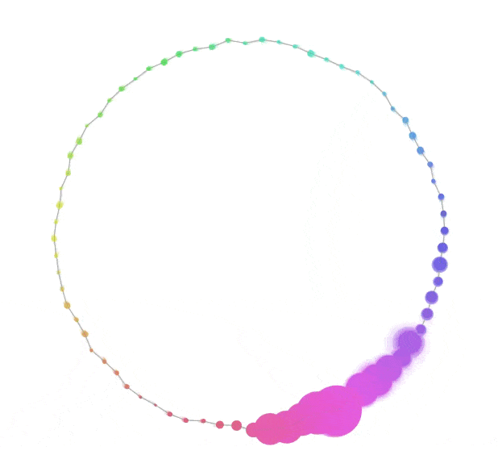

# Particula

An interactive particle system visualization built with p5.js. Particula creates a mesmerizing display of particles arranged in a circle that react to mouse movements and can operate in an automatic focus mode.

## Features

- **Interactive Particles**: A circle of particles with spring physics that respond to mouse movement
- **Mouse Interaction**: Particles repel from the mouse cursor and change size based on proximity
- **Auto-focus Mode**: Simulated mouse movement following a circular path
- **Customizable Controls**: Interactive UI to adjust all visualization parameters
- **Dynamic Visualization**: Particles connected by lines that form a cohesive, flowing shape
- **Color Transitions**: Particles change color based on their position and movement

## Getting Started

1. Clone this repository
2. Open `index.html` in a web browser
3. Interact with the particles using your mouse
4. Use the control panel to adjust parameters

## Controls

The control panel provides options to customize the visualization:

- **Particles**: Adjust the number of particles in the system
- **Radius**: Change the base radius of the particle circle
- **Wave Amplitude/Speed**: Control the oscillation of particles
- **Rotation**: Set the rotation speed of the entire system
- **Mouse Force**: Change how strongly particles repel from the mouse
- **Spring**: Adjust how quickly particles return to their base position
- **Mouse Size Effect**: Control how much particles grow when the mouse is nearby
- **Auto Focus Options**: Enable/disable and adjust the automatic focus point movement

## Technologies Used

- [p5.js](https://p5js.org/) - JavaScript library for creative coding

## License

MIT

## Author

Paul Mayne